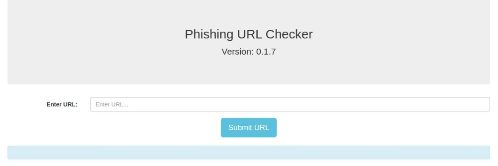
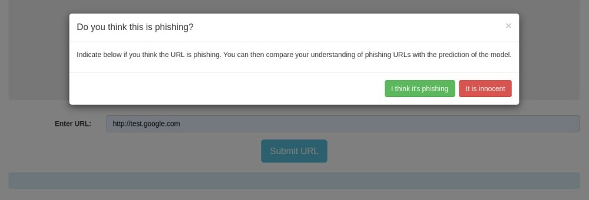

# App
This repository contains both the app-frontend and app-service for the URL phishing detection application. In the app the user can enter a URL after which the user is asked whether he/she thinks the URL is phishing or not. Afterwards, the app will return the result of the model that is trained to detect phishing.

## Instructions
All instructions assume that you are currently in the working app directory.
To run the app, simply build the container using:
```
docker build -t <tag> .
docker run -p 5000:5000 <tag>
```
You can now access the app through your browser. Please note that the app alone does not do anything, as the required backbone with a [model-service](https://github.com/REMLA24-Team-5/model-service) is not running.

## Showcase
After accessing the app, you should see the following screen (the version follows from [lib-version](https://github.com/REMLA24-Team-5/lib-version)):



After entering a URL in the "Enter URL..." field, press the "Submit URL" to get the model prediction (please note that this will return "Unknown" if the model-service is not running). Before the model prediction is presented, the user is asked on their own prediction whether the URL is phishing or not. This screen looks as follows:

